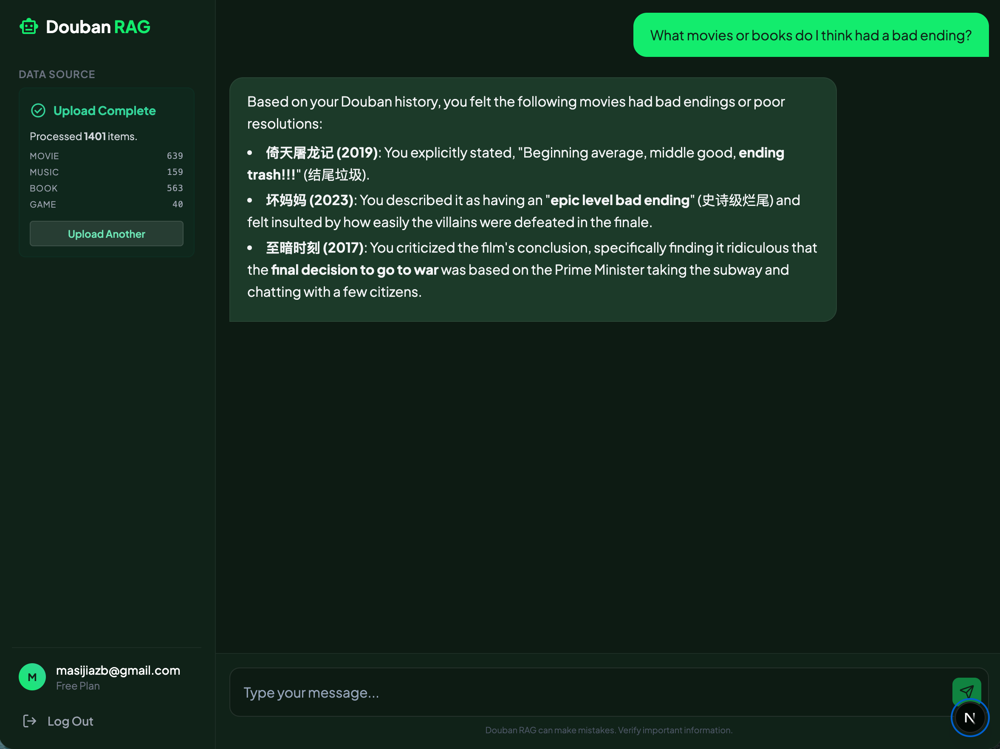

# Douban RAG System

一个现代化的智能 RAG（检索增强生成）系统，用于管理你的豆瓣历史记录。使用自然语言与你的电影、书籍、音乐和游戏收藏进行对话。



## 功能特性

- **个人知识库**：上传你的豆瓣导出文件（CSV/XLSX），创建一个可搜索的个人数据库。
- **智能对话**：使用自然语言询问关于你的历史记录的问题（例如：“我觉得哪些电影结局很糟糕？”）。
- **丰富上下文**：系统检索你的具体评论、评分和备注，生成个性化的回答。
- **统计仪表盘**：精准追踪已处理的项目数量：
  - 电影
  - 书籍
  - 音乐
  - 游戏
- **现代化界面**：专业的暗色模式界面，并在侧边栏提供实时状态更新。
- **安全认证**：由 Firebase Auth 支持的用户账户系统。

## 技术栈

- **前端**：Next.js 14 (App Router), TypeScript, Tailwind CSS
- **后端**：FastAPI, Python 3.11
- **RAG 引擎**：LlamaIndex, ChromaDB
- **Embedding 模型**：BGE-M3 (多语言支持)
- **大语言模型**：Google Gemini
- **认证**：Firebase Authentication
- **部署**：Google Cloud Run (Docker)

## 快速开始

### 前置要求

- Node.js 18+
- Python 3.11+
- Firebase 项目
- Google Gemini API Key

### 1. 后端设置

```bash
cd backend
python -m venv venv
source venv/bin/activate
pip install -r requirements.txt

# 创建 .env 文件并填入你的密钥
# GOOGLE_API_KEY=...
uvicorn app.main:app --reload --port 8000
```

### 2. 前端设置

```bash
cd frontend
npm install

# 创建 .env.local 并配置 Firebase
# NEXT_PUBLIC_FIREBASE_API_KEY=...
# NEXT_PUBLIC_BACKEND_URL=http://localhost:8000

npm run dev
```

### 3. 使用说明

1.  在浏览器打开 `http://localhost:3000`
2.  登录 / 注册账户
3.  上传你的豆瓣导出文件（支持来自 [豆伴](https://chromewebstore.google.com/detail/%E8%B1%86%E4%BC%B4%EF%BC%9A%E8%B1%86%E7%93%A3%E8%B4%A6%E5%8F%B7%E5%A4%87%E4%BB%BD%E5%B7%A5%E5%85%B7/ghppfgfeoafdcaebjoglabppkfmbcjdd) 的导出）
4.  等待处理完成（侧边栏会实时更新统计数据）
5.  开始对话！

## Docker / 部署

本项目已容器化，便于部署。

```bash
# 使用 Docker Compose 构建并运行（可选）
docker-compose up --build
```

或者使用包含的 `cloudbuild.yaml` 部署到 Google Cloud Run。

## 许可证 (License)

MIT
